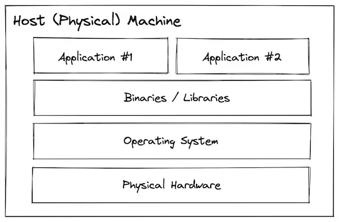
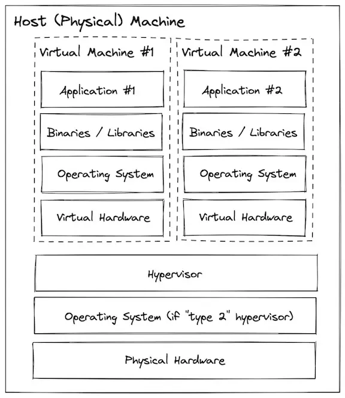
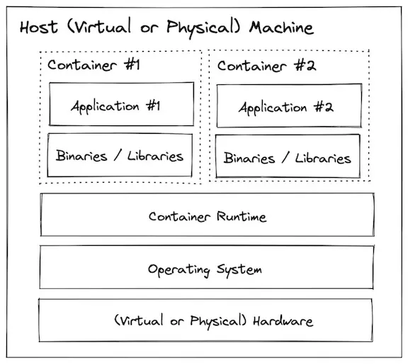
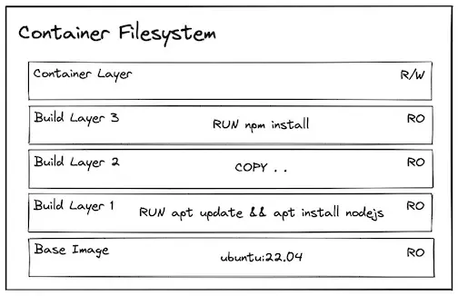

<style>

:root {
  --tha-color: #FF0350;
}

.reveal h1, .reveal h2, .reveal h3 {
  color: var(--tha-color);
}

.reveal .progress {
  color: var(--tha-color);
}

.reveal pre code {
  font-size: 0.92em;
}

.reveal table {
  font-size: 0.88em;
}

.reveal section img {
  border: none;
  box-shadow: none;
}

</style>

## Vorbereitung:

- Ordner unter `/local/users/` mit eurer RZ-Kennung anlegen, z.B. `/local/users/rzuser99`
- VirtualBox starten → **Datei → Einstellungen** → unter „Voreingestellter Pfad für VMs" diesen Ordner auswählen
- Appliance importieren:
  - Fertige Appliances liegen unter `/local/Appliances`
  - Import über **Datei → Appliance importieren** – dabei unter „Voreingestellter Pfad für VMs" den eigenen Ordner unter `/local/users/` auswählen

## Ressourcen

[Repository](https://github.com/Suppi123/docker-schulung/tree/main)

[VM](https://cloud.hs-augsburg.de/s/4kqpxk3BEJgHHJZ) (User / docker)


## Agenda:

| Block | Inhalt | Praxis |
|---|---|---|
| 1 | Grundlagen und Begriffe | Übung 1 |
| 2 | Images und Dockerfiles | Übung 2 |
| 3 | Daten, Mounts und Netzwerke | Übungen 3 und 4 |
| 4 | Multi-Container mit Compose | Übungen 5 bis 7 |
| 5 | Troubleshooting, Registries und nächste Schritte | Referenz und Praxis |


## Lernziele

- den Unterschied zwischen `Image`, `Container`, `Volume`, `Netzwerk` und `Registry` erklären
- einfache Container starten, stoppen und analysieren
- ein eigenes Image mit einem `Dockerfile` bauen
- Daten korrekt persistieren und Container miteinander verbinden
- kleine Anwendungen mit `docker compose` strukturieren
- typische Fehler schneller diagnostizieren

## Motivation

{width=50%}

## Block 1: Warum Docker?

Docker löst in Entwicklung und Betrieb ein bekanntes Problem:

- Anwendungen laufen oft nur auf einem bestimmten Rechner
- Abhängigkeiten kollidieren miteinander
- Setups kosten viel Zeit
- Fehlersuche wird unübersichtlich

**Mehrwert von Docker:** gleiche Startbasis auf vielen Systemen und schnell reproduzierbare Umgebungen.

## Von Bare Metal zu Containern

Wie hat sich die Bereitstellung von Anwendungen entwickelt?

::: {.incremental}
1. **Bare Metal** – Anwendungen direkt auf der Hardware, alles teilt sich dasselbe System
2. **Virtual Machines** – Isolation durch eigene Betriebssysteme, aber ressourcenintensiv
3. **Container** – leichtgewichtige Isolation, schnell startbar, portabel
:::

## Bare Metal

Alles direkt auf dem Host-Betriebssystem installiert.

**Nachteile:** Dependency-Konflikte, schwierige Updates, schlechtere Trennung.

{width=68%}

## Virtual Machines

Virtuelle Maschinen kapseln Anwendungen sauberer, brauchen aber mehr Ressourcen.

{width=68%}

## Container

Container sind leichter als VMs und teilen sich den Kernel des Hosts.

{width=68%}

## Container vs. virtuelle Maschinen

| Container | Virtuelle Maschine |
|---|---|
| teilen sich den Host-Kernel | eigenes Gast-Betriebssystem |
| starten schnell | schwergewichtiger |
| gut für isolierte Anwendungen | gut für komplette Systemabbilder |
| ideal für Web-Apps, APIs und Services | sinnvoll für vollständige Server-Simulation |

## OCI und Docker

Die `Open Container Initiative (OCI)` definiert offene Standards für Container.

Wichtig für die Einordnung:

- OCI ist der Standard.
- Docker ist eine konkrete Implementierung dieses Standards.
- Ein "Docker Image" ist in der Praxis meist ein OCI-kompatibles Image.
- Dadurch können verschiedene Tools und Registries zusammenarbeiten.

## Die Docker Engine

- Das CLI nimmt den Befehl entgegen, z.B. `docker run`
- Der Docker-Daemon verwaltet Images, Container, Netzwerke und Volumes
- Für Container-Images kommuniziert Docker bei Bedarf mit einer Registry
- Auf Linux läuft Docker direkt auf dem Kernel, auf Windows/macOS meist in einer Linux-VM

## Wie starte ich einen Docker Container?

```bash
docker run hello-world
```

1. Docker prüft, ob das Image lokal existiert.
2. Falls nicht, wird es aus einer Registry geladen.
3. Docker erstellt einen Container aus dem Image.
4. Der Startbefehl wird ausgeführt.

-> Guter erster Funktionstest für jede Docker-Umgebung.

## Zentrale Begriffe

| Begriff | Kurz erklärt |
|---|---|
| `Image` | Vorlage / Template |
| `Container` | laufende Instanz eines Images |
| `Registry` | Speicherort für Images |
| `Volume` | persistenter Speicher außerhalb des Containers |
| `Network` | Verbindung zwischen Containern |
| `Docker Compose` | Beschreibung mehrerer Services in YAML |

## Übung 1: Den ersten Container starten

```bash
docker run hello-world
```

**Worauf solltest du achten?**

- Wurde das Image lokal gefunden oder heruntergeladen?
- Welche Ausgabe kommt aus dem Container?
- Was bleibt nach dem Beenden übrig, was nicht?

→ `exercises/1_hello-world/`

## Zusammenfassung Block 1

- Ein `Image` ist der Bauplan, ein `Container` die laufende Instanz.
- `docker run` ist Start, Download und Ausführung in einem Ablauf.

## Block 2: Images und Dockerfiles

- wir bauen ein eigenes Image
- wir beschreiben den Build reproduzierbar
- wir trennen Dateien, Build-Schritte und Startbefehl

## Was ist ein Dockerfile?

Ein `Dockerfile` ist das Rezept zum Erzeugen eines Images.

Typische Reihenfolge:

1. Basis-Image wählen
2. Arbeitsverzeichnis setzen
3. Abhängigkeiten installieren
4. Anwendung kopieren
5. Startbefehl festlegen

## Layer und Caching

Images bestehen aus Schichten. Das ist wichtig für Geschwindigkeit und Verständlichkeit.

```Dockerfile
FROM node:20-alpine
WORKDIR /app
COPY package*.json ./
RUN npm ci
COPY . .
CMD ["npm", "start"]
```

{width=58%}

Warum diese Reihenfolge?

- Abhängigkeiten ändern sich seltener als Quellcode.
- Docker kann den `npm ci`-Schritt wiederverwenden.
- Builds werden dadurch lokal und in CI deutlich schneller.

## Container Filesystem

{width=70%}

## Build-Kontext und `.dockerignore`

Beim Bauen wird ein Kontext an Docker gesendet. Alles im Kontext kostet Zeit und kann Probleme verursachen.

`.dockerignore` sollte mindestens ausschließen:

- `node_modules`
- Build-Artefakte
- lokale `.git`-Ordner
- temporäre Dateien
- Geheimnisse und `.env`-Dateien, falls sie nicht ins Image gehören

## Dockerfile-Best-Practices

- kleine Basis-Images bevorzugen, z.B. `alpine`, nur wenn passend
- Tags bewusst setzen statt blind `latest` zu verwenden
- keine Zugangsdaten in Images kopieren
- ein Container, eine Hauptaufgabe
- Reihenfolge im Dockerfile cache-freundlich wählen
- `EXPOSE` dokumentiert den Port, gibt ihn aber nicht automatisch frei

## Wichtige Dockerfile-Anweisungen

| Anweisung | Zweck |
|---|---|
| `FROM` | Basis-Image festlegen |
| `WORKDIR` | Arbeitsordner setzen |
| `COPY` | Dateien ins Image kopieren |
| `RUN` | Build-Schritt ausführen |
| `EXPOSE` | genutzten Port dokumentieren |
| `CMD` | Standard-Startbefehl definieren |


## Übung 2: Einfacher Webserver

**Ziel:** Erstes eigenes Image bauen und lokal testen.

```bash
docker build -t simple-webserver .
docker run -d -p 80:80 --name simple-webserver simple-webserver
```

**Worauf solltest du achten?**

- Welche Dateien landen im Image?
- Was wäre der Unterschied zwischen `COPY . .` und einem selektiven `COPY`?
- Warum ist `-p 80:80` nötig?

→ `exercises/2_small-web-server/`

## Zusammenfassung Block 2

- `Dockerfile` bedeutet: Build-Prozess zu automatisieren und damit auch zu dokumentieren.
- Layer-Caching spart Zeit und macht Builds schneller.
- Gute Dockerfiles sind klein, klar und reproduzierbar.

## Block 3: Daten, Mounts und Netzwerke

Wichtig in der Praxis:

- Container sind nicht automatisch dauerhaft
- Daten liegen nicht "einfach so" auf dem Host
- mehrere Container brauchen ein gemeinsames Netzwerkmodell

## Container sind ephemer

Ein Container ist für Ausführung gedacht, nicht als dauerhafte Ablage.

Wichtig dabei:

- Änderungen im beschreibbaren Layer gehen beim Entfernen des Containers verloren
- Persistenz wird bewusst über Volumes oder Bind Mounts hergestellt

## Named Volumes vs. Bind Mounts

| Typ | Wann sinnvoll? | Vorteil |
|---|---|---|
| Named Volume | Datenbank, App-Daten, langlebige Daten | Docker verwaltet den Speicherort |
| Bind Mount | Entwicklung, Konfiguration, Dateiaustausch | Host-Dateien direkt sichtbar |

Beispiele aus der Praxis:

- Postgres-Daten in ein Volume
- Frontend-Quellcode im Entwicklungsmodus als Bind Mount

## Übung 3: Datenpersistenz

→ `exercises/3_datenpersistence/`

## Docker-Netzwerke verstehen

- Container im selben benutzerdefinierten Netzwerk erreichen sich über ihren Namen
- `localhost` im Container ist nicht der Host
- veröffentlichte Ports (`-p`) sind für Zugriffe von außen
- interne Kommunikation läuft meist über Container-Namen und interne Ports

## Übung 4: Multi-Container-Anwendung

**Architektur aus der Übung:**

- PostgreSQL
- Node.js API
- Golang API
- React-Client mit Nginx

→ `exercises/4_application/`

## Typische Fehlerbilder bei Docker Netzwerken

- Port ist schon belegt
- Container spricht auf `localhost` statt auf den Service-Namen
- Daten sind "weg", weil kein Volume verwendet wurde
- falscher Zielpfad im Mount
- Netzwerkname oder Containername stimmt nicht

**Bewährte Diagnosebefehle:** `docker ps`, `docker logs <name>`, `docker volume ls`, `docker network ls`

## Zusammenfassung Block 3

- Persistenz muss bewusst geplant werden.
- `Volume` und `Bind Mount` sind nicht dasselbe.
- Netzwerke erklären, warum Multi-Container-Anwendungen zuverlässig miteinander sprechen.

## Block 4: Multi-Container mit Docker Compose

Ab jetzt wird aus vielen Einzelbefehlen eine strukturierte Konfiguration.

Compose ist praktisch, weil es:

- Komplexität reduziert
- Architektur sichtbar macht
- Änderungen versionierbar macht

## Warum Compose?

Mit Compose werden Services, Netzwerke und Volumes in einer Datei beschrieben:

- leichter lesbar
- leichter zu ändern
- leichter zu verstehen

## Compose-Datei lesen

```yaml
services:
  db:
    image: postgres:15.1-alpine
    volumes:
      - pgdata:/var/lib/postgresql/data

  api:
    build: ./api
    depends_on:
      - db

volumes:
  pgdata:
```

Wichtig: Servicenamen werden im Compose-Netzwerk automatisch zu DNS-Namen.

## Compose: Wichtige Konzepte

- `services`: welche Container zur Anwendung gehören
- `build` oder `image`: selbst bauen oder fertiges Image nutzen
- `ports`: Host-Port zu Container-Port
- `volumes`: dauerhafte Daten
- `depends_on`: Startreihenfolge, aber nicht automatisch "bereit"
- `networks`: gezielte Trennung oder Kopplung von Services

## Zusatzwissen: `depends_on` ist keine Readiness-Prüfung

Das ist wichtig, weil es in Projekten oft falsch verstanden wird.

- `depends_on` startet Services in einer Reihenfolge
- es prüft nicht automatisch, ob die Datenbank schon Anfragen annimmt
- für robuste Setups helfen `healthcheck`, Retry-Logik oder ein Wait-Script

## Übung 5: Von `docker run` zu Compose

**Ziel:** Die Multi-Container-Anwendung aus Übung 4 in YAML ausdrücken.

Empfohlene Befehle:

```bash
docker compose build
docker compose up -d
docker compose ps
docker compose down
```

→ `exercises/5_docker-compose/`

## Compose-Troubleshooting

Die wichtigsten Befehle:

| Befehl | Nutzen |
|---|---|
| `docker compose config` | YAML prüfen und aufgelöst anzeigen |
| `docker compose ps` | Status sehen |
| `docker compose logs -f` | Logs live verfolgen |
| `docker compose exec <service> sh` | in einen Service hineinschauen |
| `docker compose down` | Umgebung sauber abbauen |

Hinweis: `docker compose down -v` löscht auch Volumes und damit oft absichtlich gespeicherte Daten.

## Übung 6: Wetter-App

Selbstständige Anwendung des gelernten.

Aufgabe:

- erstelle ein Dockerfile für das Python-Backend
- erstelle ein Dockerfile für das Nginx-Frontend
- erstelle eine `docker-compose.yml` für beide Services

→ `exercises/6_weather-app/`

## Übung 7: Praxisbeispiele mit Compose

Mögliche Beispiele aus dem Repo:

- Portainer
- Uptime Kuma
- Homepage
- Home Assistant

Diese Beispiele zeigen typische reale Compose-Setups:

- Welche Volumes werden genutzt?
- Welche Ports werden veröffentlicht?
- Welche Einstellungen wirken produktionsnah?

→ `exercises/7_example-projects/`

## Kurzfazit Block 4

- Compose macht Architektur lesbar und wartbar.
- Service-Namen sind im Compose-Netzwerk gleichzeitig Kommunikationsnamen.

## Block 5: Troubleshooting und nächste Schritte

Zum Einstieg gehört auch, typische Probleme schnell einzuordnen.

Häufige Fragen:

- Warum startet ein Container nicht?
- Warum ist ein Port nicht erreichbar?
- Warum fehlen Daten nach einem Neustart?
- Warum findet ein Container einen anderen Service nicht?

## Typische Diagnosebefehle

| Befehl | Nutzen |
|---|---|
| `docker ps -a` | laufende und gestoppte Container anzeigen |
| `docker logs <name>` | Ausgabe eines Containers ansehen |
| `docker exec -it <name> sh` | in einen laufenden Container wechseln |
| `docker inspect <name>` | Details zu Container, Netzwerk und Mounts |
| `docker compose logs -f` | Logs einer Compose-Umgebung verfolgen |

## Aufräumen

```bash
docker stop <name>
docker rm <name>
docker compose down
docker volume ls
docker network ls
```

Vorsicht bei `docker system prune -a`: dabei werden ungenutzte Images ebenfalls entfernt.

## Container Registries

Images werden in Registries gespeichert und verteilt.

Beispiele:

- Docker Hub
- GitHub Container Registry
- GitLab Container Registry
- Harbor

## Container Registries: Befehle

```bash
docker pull postgres:15.1-alpine
docker push meinuser/meinimage
```

`docker run postgres:15.1-alpine` lädt das Image bei Bedarf automatisch aus einer Registry.

## Wie geht es weiter?

Nach diesem Einstieg bieten sich als nächste Themen an:

- Multi-Stage-Builds
- eigene Registries und Image-Versionierung
- CI/CD mit Docker
- Reverse Proxy und Deployment
- später auch Kubernetes als nächster Schritt

## Kurzfazit Block 5

- Mit Logs, Inspect und Compose-Befehlen lassen sich viele Fehler schnell eingrenzen.
- Registries sind die Drehscheibe für das Verteilen von Images.
- Nach dem Einstieg folgt meist der Weg zu saubereren Builds und realen Deployments.

## Abschluss und Referenzen

- Cheatsheet: `exercises/cheatsheet.md`
- Übungen: `exercises/`
- Dokumentation: [docs.docker.com](https://docs.docker.com/)
- Compose-Referenz: [docs.docker.com/compose](https://docs.docker.com/compose/)
- Docker Tutorial: [Docker: Beginner to Pro](https://courses.devopsdirective.com/docker-beginner-to-pro)
