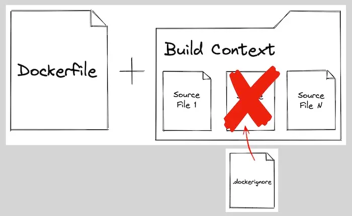

<style>

:root {
  --tha-blue: #FF0350;
}

.reveal h1, .reveal h2, .reveal h3 {
  color: var(--tha-blue);
}

.reveal .progress {
  color: var(--tha-blue);
}

.reveal pre code {
  font-size: 0.95em;
}

.reveal table {
  font-size: 0.9em;
}

.reveal section img {
  border: none;
  box-shadow: none;
}

</style>
## Agenda: Der Fahrplan (7h)

::: {.incremental}
1.  **Block 1: Die Welt der Container** (Grundlagen, Architektur, Hello World)
2.  **Block 2: Das eigene Rezept** (Dockerfiles, Layer-Caching, Best Practices)
3.  **Block 3: Wo sind meine Daten?** (Volumes, Bind-Mounts, Networking)
4.  **Block 4: Orchestrierung im Kleinen** (Docker Compose, Multi-Container-Apps)
5.  **Block 5: Didaktik & Praxis** (Troubleshooting, IHK-Relevanz, Übungsprojekt)
:::


## Motivation

Die Umgebung für Entwicklung und Betrieb von Anwendungen aufzusetzen, war früher ein komplexer und fehleranfälliger Prozess. Zusätzlich musste auf Besonderheiten und Unterschiede zwischen verschiedenen Betriebssystemen geachtet werden.

::: {.fragment}
**Docker vereinfacht** sowohl den Entwicklungs- als auch den Deploymentprozess von Anwendungen.
:::

::: {.fragment}
- Ein Befehl → komplette Umgebung
- Gleiche Umgebung auf Windows, Mac, Linux
- Ein standardisiertes Paket für Deployment
:::

## Was ist ein Container?

Ein **Container** ist ein alleinstehendes, ausführbares Softwarepaket, das alles beinhaltet, was die Anwendung benötigt, um zu laufen:

- Betriebssystem
- Laufzeitabhängigkeiten (z.B. Python Runtime)
- Bibliotheken
- Code der Anwendung

::: {.fragment}
**Analogie (OOP):** Container-Images ≈ Klassen · Container ≈ Objekte/Instanzen einer Klasse
:::

## Open Container Initiative (OCI)

Docker ist eine Implementierung des **OCI-Standards**. Dieser legt fest:

- **Image-Spezifikationen:** Metadata und Datenformat
- **Laufzeit-Spezifikationen:** Wie Container auf Basis von Images gestartet werden
- **Verteilungs-Spezifikationen:** Wie Images verteilt werden (Registries, Push, Pull)

## Geschichte: Arten, eine Anwendung zu installieren

## Bare Metal

Alles direkt auf dem Host-Betriebssystem installiert.

**Nachteile:** Dependency-Konflikte, Server unter Umständen schlecht ausgelastet.

{width=65%}

## Virtual Machines

Keine Dependency-Konflikte, bessere Auslastung – aber ressourcenintensiv.

{width=65%}

## Container

Keine Dependency-Konflikte, noch bessere Auslastung als VMs – **leichtgewichtig**.

Container nutzen den Host-Kernel – daher schnell und schlank.

{width=65%}

## Linux Building Blocks

Die technische Grundlage von Containern:

- **cgroups** – Ressourcenbegrenzung (CPU, RAM, I/O)
- **namespaces** – Isolation (Prozesse, Netzwerk, Dateisystem)
- **Union Filesystems** – effiziente Schichten für Images

## Docker Software: Client

- Command Line Interface (CLI)
- Graphical User Interface (GUI)
- Credential Helper
- Extensions

## Docker Software: Daemon

Die **Linux-(virtuelle) Maschine** enthält:

- **Docker Daemon** (`dockerd`) – verwaltet Container, Images, Netzwerke, Volumes

## Docker Engine vs. Docker Desktop

| Komponente | Inhalt |
|------------|--------|
| **Docker Engine** | CLI + Daemon (`dockerd`) |
| **Docker Desktop** | Engine + GUI + zusätzliche Tools |

## Docker Swarm

Existiert als eingebaute Orchestrierungs-Lösung – Alternative zu Kubernetes für einfachere Szenarien.

## Container Registries (Überblick)

Registries gehören nicht direkt zu Docker, werden aber verwendet, um Container zu **speichern**, zu **verwalten** und zu **teilen**.

**Beispiele:** Docker Hub, GitHub Container Registry, GitLab, Harbor

## Übung 1: Den ersten Container starten

**Ziel:** Prüfen, ob Docker läuft und ein erstes Image ausführen.

```bash
docker run hello-world
```

Weiteres Beispiel (PostgreSQL):

```bash
docker run -e POSTGRES_PASSWORD=foobarbaz -p 5432:5432 postgres:15.1-alpine
```

::: {.fragment}
- `docker run` = Image starten (wird bei Bedarf automatisch heruntergeladen)
- `-e` = Umgebungsvariable · `-p` = Port-Mapping (Host:Container)
:::

## Übung 1: Los geht's

**Aufgabe:** Führe `docker run hello-world` aus und prüfe die Ausgabe.

→ `exercices/1_hello-world/`

## Übung 2: Einfacher Webserver

**Ziel:** Eigenes Image bauen und einen Webserver starten.

```bash
docker build -t simple-webserver .
docker run -d -p 80:80 --name simple-webserver simple-webserver
```

::: {.fragment}
- `-t` = Tag/Name für das Image · `-d` = im Hintergrund
- `-p 80:80` = Port-Mapping (Host:Container) · `--name` = Container benennen
:::

## Übung 2: Los geht's

**Aufgaben:**

1. Image bauen: `docker build -t simple-webserver .`
2. Container starten: `docker run -d -p 80:80 --name simple-webserver simple-webserver`
3. Im Browser prüfen: http://localhost

→ `exercices/2_small-web-server/`

## Was ist ein Dockerfile?

Ein **Dockerfile** ist die Anleitung zum Bauen eines Images:

```
1. Basis-Image (z.B. nginx:alpine)
2. Abhängigkeiten installieren
3. Code/Dateien kopieren
4. Startbefehl definieren
```

## Container-Images: Schichten

Images bestehen aus übereinanderliegenden **Layern** (Union Filesystem).

{width=55%}

## Wichtige Dockerfile-Anweisungen

| Anweisung | Zweck |
|-----------|-------|
| `FROM` | Basis-Image |
| `WORKDIR` | Arbeitsverzeichnis |
| `COPY` | Dateien ins Image kopieren |
| `RUN` | Befehl beim Bauen ausführen |
| `EXPOSE` | Port dokumentieren |
| `CMD` | Standard-Startbefehl |

## .dockerignore

Nutze `.dockerignore`, um unnötige Dateien aus dem Build-Kontext auszuschließen.

{width=70%}

## Datenpersistenz: Warum Volumes?

Container bestehen aus verschiedenen **Layern**. Nur der letzte Layer ist read/write.

{width=50%}

## Datenpersistenz: Ephemeral

Zur Laufzeit kannst du z.B. Software im Container installieren – nach einem **Neustart** ist der Container aber wieder im Ausgangszustand.

Man kann Container benennen, um Änderungen zu erhalten – aber grundsätzlich will man **keine Daten im Container** persistieren. Dafür nutzt man **Volumes** und **Mounts**.

## Übung 3: Datenpersistenz

**Problem:** Container sind ephemer – beim Beenden gehen Daten verloren.

**Zwei Lösungen:**

1. **Named Volumes** – Docker verwaltet den Speicherort
2. **Bind Mounts** – Host-Verzeichnis direkt einbinden

## Übung 3: Los geht's

**Aufgaben:**

1. **Ephemeral:** Ubuntu-Container starten, `ping` installieren, exit – in neuem Container prüfen: ping fehlt
2. **Named Volume:** Volume erstellen, Datei in `/my-data/` speichern, in neuem Container prüfen
3. **Bind Mount:** Host-Verzeichnis mounten, Datei speichern, auf Host sichtbar?

→ `exercices/3_datenpersistenz/`

## Named Volumes (Volume Mounts)

```bash
docker volume create my-volume
docker run -it --rm -v my-volume:/my-data ubuntu:22.04
```

::: {.fragment}
- Daten überleben Container-Neustarts
- Docker verwaltet Speicherort
- Ideal für Datenbanken, Log-Daten, etc.
:::

## Bind Mounts

```bash
docker run -it --rm -v ${PWD}/my-data:/my-data ubuntu:22.04
```

::: {.fragment}
- Host-Verzeichnis direkt gemountet
- Ideal für Entwicklung (Live-Reload)
- Daten sichtbar auf dem Host
:::

## Übung 4: Multi-Container-Anwendung

**Ziel:** Mehrere Container über ein Netzwerk verbinden.

**Architektur:**

- PostgreSQL (Datenbank)
- Node.js API
- Golang API
- React-Client (Nginx)

## Übung 4: Los geht's

**Aufgaben:**

1. Netzwerk `my-network` erstellen
2. PostgreSQL starten (Volume `pgdata`)
3. Node-API & Golang-API bauen und starten
4. React-Client bauen und starten
5. Aufräumen: `docker stop` → `docker rm` → `docker network rm`

→ `exercices/4_application/`

## Docker-Netzwerke

```bash
docker network create my-network
docker run --network my-network --name db -e POSTGRES_PASSWORD=... postgres:15.1-alpine
docker run --network my-network -e DATABASE_URL=postgres://postgres:...@db:5432/... api-node
```

::: {.fragment}
- Container im gleichen Netzwerk können sich per **Namen** erreichen (`db`, `api-node`)
- `-e` = Umgebungsvariablen setzen
:::

## Übung 5: Docker Compose

**Ziel:** Übung 4 mit einer YAML-Datei statt vieler `docker run`-Befehle.

```bash
docker compose build
docker compose up -d
```

::: {.fragment}
- `docker-compose.yml` definiert Services, Netzwerke, Volumes
- `depends_on` steuert Startreihenfolge
- `docker compose down` räumt alles auf
:::

## Übung 5: Los geht's

**Aufgaben:**

1. `docker compose build` – alle Images bauen
2. `docker compose up -d` – Anwendung starten
3. Im Browser testen (Port 80)
4. `docker compose down` – alles aufräumen

→ `exercices/5_docker-compose/`

## Übung 6: Wetter-App

**Ziel:** Eigenständig Dockerfiles und Docker Compose erstellen.

**Architektur:**

- **Backend:** Python/Flask (Open-Meteo API)
- **Frontend:** HTML/JS + Nginx (Proxy zu Backend)

→ `exercices/6_weather-app/`

## Übung 6: Aufgaben

1. **Backend-Dockerfile** – Python-Image, `pip install -r requirements.txt`, `app.py` kopieren, Port 5000
2. **Frontend-Dockerfile** – Nginx-Alpine, `index.html`, `style.css`, `app.js`, `nginx.conf`, Port 80
3. **docker-compose.yml** – `frontend` + `backend`, gemeinsames Netzwerk, Port 8080, `depends_on`

Nginx proxied `/api/` an den Backend-Container. → `exercices/6_weather-app/`

## Übung 7: Bonus – Praxisbeispiele

Starte eine echte Anwendung mit Docker Compose:

- **Portainer** – Web-UI für Docker
- **Uptime Kuma** – Monitoring

## Übung 7: Weitere Beispiele

- **Homepage** – Dashboard für Selfhosted-Services
- **Home Assistant** – Home-Automation

## Übung 7: Los geht's

**Aufgabe:** Wähle ein Projekt (Portainer, Uptime Kuma, Homepage, …), finde die `docker-compose.yml` und starte die Anwendung mit `docker compose up -d`.

→ `exercices/7_example-projects/`

## Wichtige docker run Optionen (1/2)

| Option | Bedeutung |
|--------|-----------|
| `-d` | Im Hintergrund (detached) |
| `-p HOST:CONTAINER` | Port-Mapping |
| `-e VAR=wert` | Umgebungsvariable |
| `-v volume:/pfad` | Volume mounten |

## Wichtige docker run Optionen (2/2)

| Option | Bedeutung |
|--------|-----------|
| `--network NAME` | Netzwerk verbinden |
| `--name NAME` | Container benennen |
| `--rm` | Container nach Beendigung löschen |
| `-it` | Interaktiv + TTY |

## Wichtige Docker Compose Befehle

| Befehl | Bedeutung |
|--------|-----------|
| `docker compose up -d` | Services starten (Hintergrund) |
| `docker compose down` | Alles stoppen und entfernen |
| `docker compose build` | Images bauen |
| `docker compose logs -f` | Logs anzeigen |
| `docker compose ps` | Status der Container |

## Aufräumen

```bash
# Einzelne Container
docker stop <name>
docker rm <name>

# Netzwerk
docker network rm my-network

# Alles auf einmal
docker system prune -a
```

## Aufräumen – Vorsicht

**`prune -a`** löscht alle ungenutzten Images!

## Container Registries (Referenz)

Images werden in **Registries** gespeichert und verteilt – Docker Hub, GitHub, GitLab, Harbor, etc.

## Container Registries – Befehle

```bash
docker pull postgres:15.1-alpine   # Image herunterladen
docker push meinuser/meinimage    # Eigenes Image hochladen
```

`docker run postgres:15.1-alpine` lädt bei Bedarf automatisch von Docker Hub.

## Zusammenfassung (1/2)

- **Container** = isolierte, portable Softwarepakete
- **Dockerfile** = Rezept für Images
- **Volumes** = Daten persistieren (named volumes, bind mounts)

## Zusammenfassung (2/2)

- **Netzwerke** = Container verbinden
- **Docker Compose** = Multi-Container-Apps einfach definieren

**Cheatsheet:** `exercices/cheatsheet.md`

## Vielen Dank!

**Weiterführende Ressourcen:**

- [Docker: Beginner to Pro](https://courses.devopsdirective.com/docker-beginner-to-pro/)
- [Docker Dokumentation](https://docs.docker.com/)
- [Docker Tutorial (YouTube)](https://www.youtube.com/watch?v=9ivFrXgB2Zg&t=110s)
